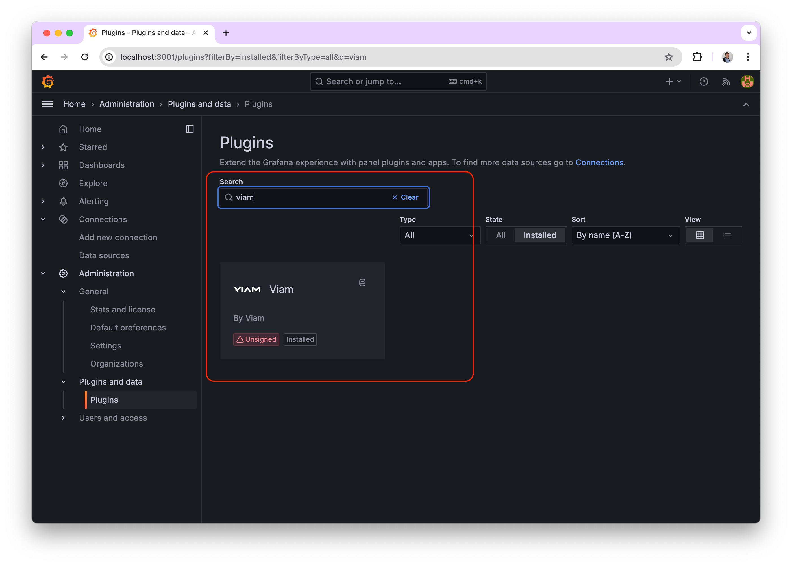
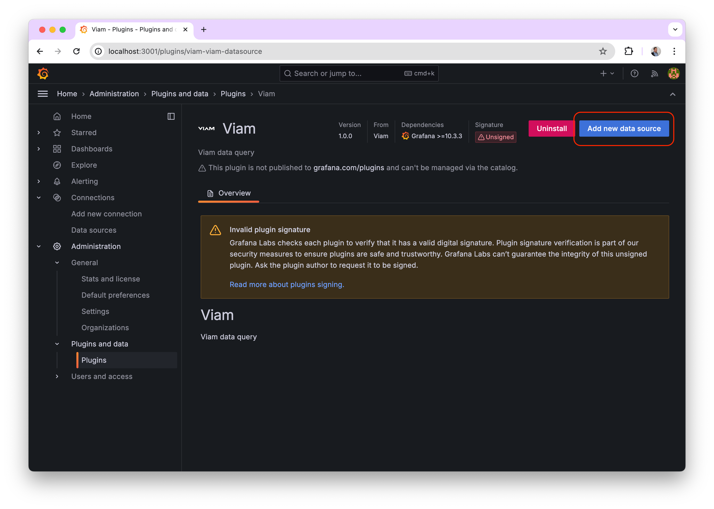
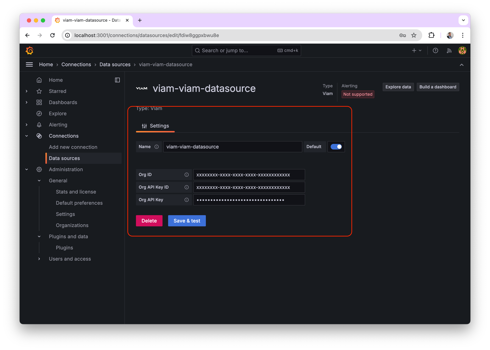
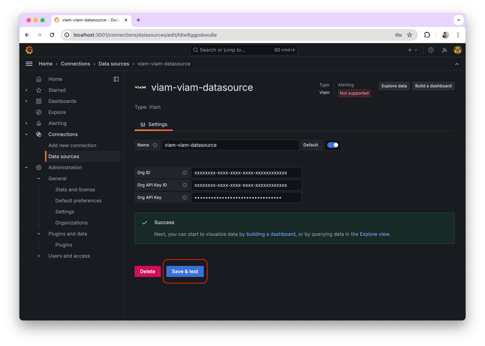
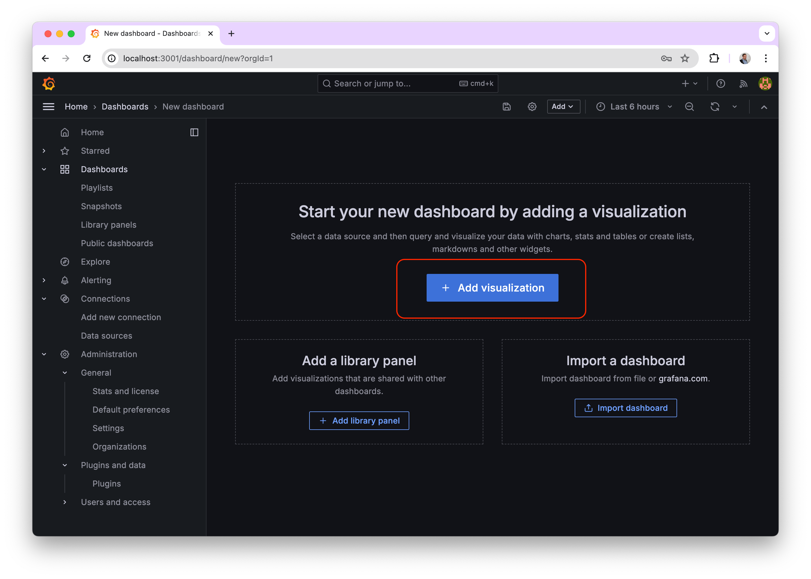
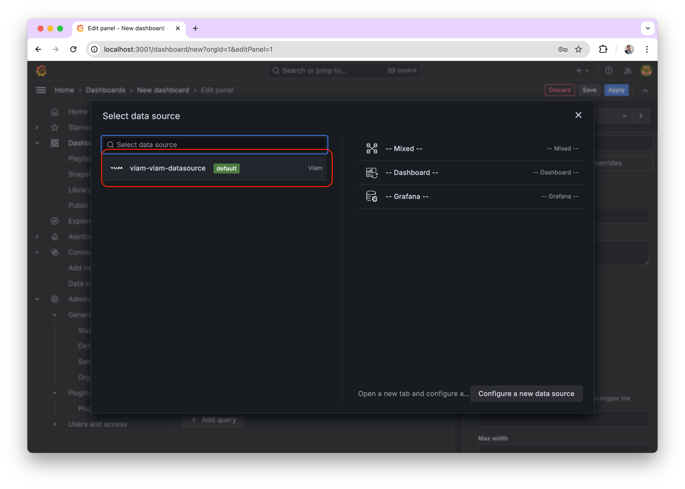
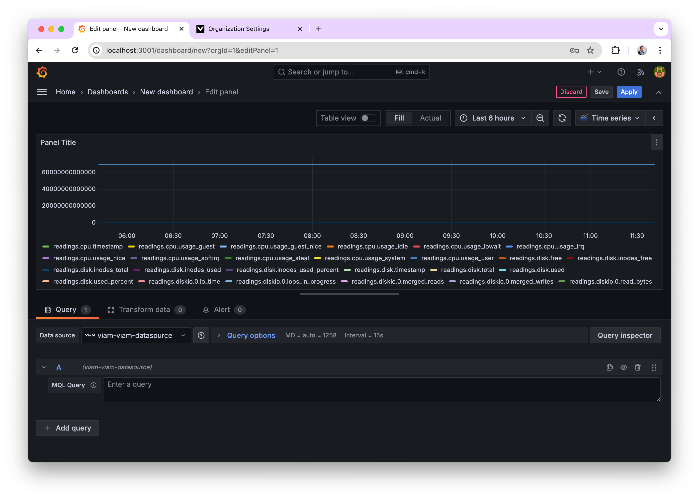
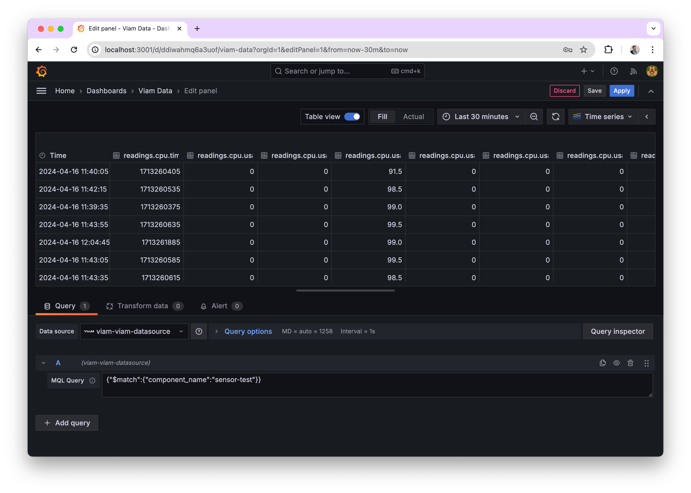

# Configure The Viam - Grafana Plugin

## 1. Login to your Grafana instance and navigate to Administration/Plugins and data/plugins and search for "viam"

## 2. Add a new data source

## 3. Add your app.viam.com organization id, an api key id and the secret

## 4. Save the new data source

## 5. Configure your database in terminal to be accessible by grafana

Run the following lines, choosing a password that is at least 8 characters long with 1 uppercase, 1 number, and 1 special character.

`viam data database configure --org-id=<org-id> --password=<db-user-password>`

`viam data database hostname --org-id=<org-id>`

save the chosen password and resulting hostname (your user name for MongoDB will now be db-user-`<org_id>`).

Once a few minute has passed, your data should be available on grafana!

### (Optional) Confirm the data federation connection using mongosh:

`mongosh mongodb://<hostname>/sensorData?authSource=admin\&tls=true -u <username> -p <password>`

Then
`show collections;` -> readings

`AtlasDataFederation sensorData> db.readings.findOne()`

## 6. Add a new dashboard

## 7. Choose the previously created data source

## 8. Wait for the default query to load some data

## 9. Add your own MQL query as shown on the screenshot

TODO: Seems we don't return the meta data yet